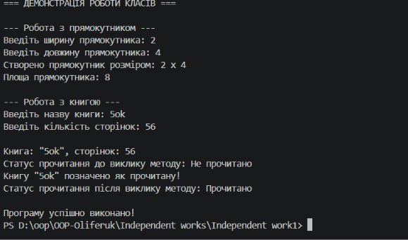

# Самостійна робота №1: Базовий синтаксис С# і оголошення класів

**Студент:** Оліферук  

## Мета
Закріпити навички оголошення класів, полів, властивостей та методів у С# для моделювання об'єктів реального світу.

## Хід роботи
1. Створено новий консольний проєкт `IndependentWork1`.
2. У файлі `Program.cs` оголошено класи `Rectangle` та `Book` для моделювання об'єктів реального світу:
   - **`Rectangle`**: містить приватні поля `_length` і `_width`, властивості `Width` та `Length`, конструктор та метод `CalculateArea()` для обчислення площі прямокутника.
   - **`Book`**: містить приватні поля `_title`, `_pages` і `_isRead`, read-only властивості `Title`, `Pages`, `IsRead`, конструктор та метод `MarkAsRead()` для зміни стану прочитання книги.
3. У методі `Main` реалізовано інтерактивне введення даних користувачем, створення екземплярів класів та виклик їхніх методів із виводом результатів у консоль.

## Результат виконання

## Висновок
Під час виконання самостійної роботи було практично засвоєно базові принципи інкапсуляції в С#. Приватні поля гарантують захист даних об'єкта, публічні властивості забезпечують контрольований доступ до них, а конструктори дозволяють коректно ініціалізувати початковий стан об'єктів при їх створенні.