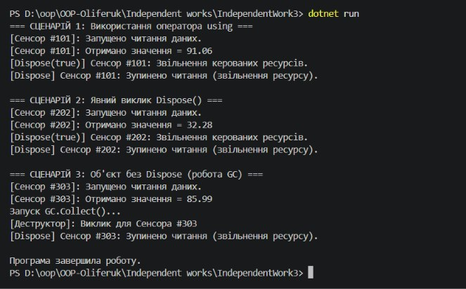

# Самостійна робота №3: Життєвий цикл об'єкта та керування ресурсами

**Студент:** Оліферук  
**Варіант:** №16 (`SensorReader`)  

## Мета
Поглибити розуміння життєвого циклу об'єкта в С#, навчитися працювати з некерованими ресурсами, самостійно реалізувати інтерфейс `IDisposable` та повний паттерн `Dispose`.

## Хід роботи
1. Створено консольний проєкт `IndependentWork3`.
2. У файлі `Program.cs` реалізовано клас `SensorReader`, який описує читання даних з сенсора та реалізує інтерфейс `IDisposable` (містить поля `_sensorId`, `_isReading`, `_disposed`, конструктор, метод `ReadValue()`, метод `Dispose()`, захищений метод `Dispose(bool disposing)` та деструктор `~SensorReader()`).
3. У методі `Main` продемонстровано три сценарії використання об'єкта:
   - Конструкція `using` для автоматичного звільнення ресурсів.
   - Явний виклик методу `Dispose()`.
   - Створення об'єкта без `Dispose()` із примусовим викликом `GC.Collect()` та `GC.WaitForPendingFinalizers()`.

## Результат виконання

## Висновок
Під час виконання самостійної роботи було засвоєно життєвий цикл об'єкта в .NET. Найкращим та найбезпечнішим способом керування ресурсами є оператор `using`, який автоматично гарантує виклик `Dispose()`. Явний виклик `Dispose()` використовується при ручному управлінні, а деструктор (фіналізатор) слугує страховочним механізмом для GC, якщо розробник забув закрити ресурс.