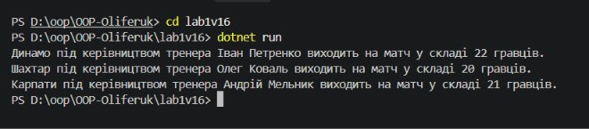

# Лабораторна робота №1 — Варіант 16

## Тема
Створення першого проєкту. Класи, об'єкти, конструктори та деструктори. Середовище розробки.

## Мета
Ознайомитися з середовищем розробки, навчитися створювати класи та працювати з базовими елементами ООП у C#.

## Опис класу
Клас: `SportTeam`

| Елемент | Опис |
|---|---|
| Поля (private) | `name`, `coach` |
| Властивість (public) | `PlayersCount` |
| Конструктор | ініціалізує `name`, `coach`, `PlayersCount` |
| Метод | `PlayMatch()` — виводить повідомлення про матч команди |

## Хід роботи
1. Встановлено Visual Studio Code, розширення C# Dev Kit та .NET Install Tool.
2. Створено консольний проєкт командою:
   ```
   dotnet new console -o OOP-<Прізвище>/lab1v16
   ```
3. Реалізовано клас `SportTeam` з приватними полями, публічною властивістю, конструктором та методом `PlayMatch()`.
4. У методі `Main` створено 3 об'єкти класу, викликано метод `PlayMatch()` для кожного.
5. Налаштовано `.gitignore` для C#/.NET/VS Code.
6. Код завантажено у віддалений репозиторій на GitHub.

## Результат виконання


## Контрольні запитання

**1. Що таке клас та об'єкт? Яка між ними різниця?**
Клас — це шаблон (опис структури та поведінки), а об'єкт — конкретний екземпляр, створений на основі цього шаблону за допомогою `new`.

**2. Для чого використовуються конструктори? Чи може клас існувати без них?**
Конструктор ініціалізує початковий стан об'єкта під час його створення. Клас може існувати без явно заданого конструктора — тоді компілятор автоматично генерує конструктор за замовчуванням.

**3. Чим відрізняється приватне поле від публічної властивості? Навіщо потрібна інкапсуляція?**
Приватне поле доступне лише всередині класу, публічна властивість надає контрольований доступ до цього поля ззовні (через get/set). Інкапсуляція приховує внутрішню реалізацію та захищає дані від некоректних змін.

## Висновок
Ознайомився із середовищем розробки .NET, навчився створювати клас з приватними полями, публічними властивостями, конструктором і методом, а також працювати з об'єктами у C#.