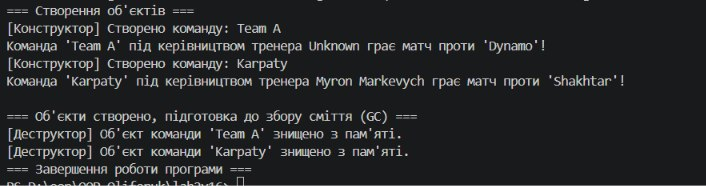

# Лабораторна робота №2

**Тема:** Клас із кількома конструкторами. Життєвий цикл об'єкта.  
**Варіант:** 16 (`SportTeam`)

---

## Мета роботи
Навчитися реалізовувати перевантажені конструктори в C#, використовувати ланцюговий виклик конструкторів через `: this()`, розібратися з валідацією даних у властивостях та дослідити життєвий цикл об'єкта разом із роботою збирача сміття (Garbage Collector).

---

## Хід роботи

1. Створив новий консольний проєкт у папці `lab2v16` за допомогою команди `dotnet new console`.
2. Реалізував клас `SportTeam` відповідно до свого варіанту (Варіант 16):
   - Додав приватні поля `_name`, `_coach`, `_playersCount`.
   - Реалізував властивості з валідацією (кількість гравців `PlayersCount` повинна бути більше 0).
   - Зробив два перевантажені конструктори, один з яких використовує ланцюговий виклик `: this(...)`.
   - Додав метод `PlayMatch(string opponent)` для виводу інформації про гру.
   - Додав деструктор `~SportTeam()`, який виводить повідомлення про знищення об'єкта з пам'яті.
3. У методі `Main` створив декілька об'єктів різними конструкторами, викликав їхні методи та запустив примусове збирання сміття через `GC.Collect()` і `GC.WaitForPendingFinalizers()`.

---

## Результат роботи програми

Нижче наведено скріншот виконання програми в консолі:

---

## Висновок
Під час виконання лабораторної роботи я навчився перевантажувати конструктори та використовувати конструкторний ланцюжок `: this()`, що дозволяє не дублювати однакові значення при ініціалізації. Також розібрався, як працює життєвий цикл об'єкта в C#: від створення пам'яті через `new` до його автоматичного чищення збирачем сміття (GC) із викликом деструктора.