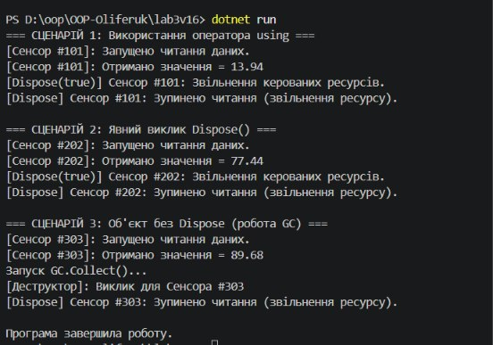

Лабораторна робота №3

Тема: Життєвий цикл об'єкта та керування ресурсами.

Студент: Оліферук

Варіант: №16 (SensorReader)

Мета

Поглибити розуміння життєвого циклу об'єкта в С#, навчитися працювати з некерованими ресурсами, реалізувати інтерфейс IDisposable та патерн Dispose.

Хід роботи

Створення проєкту: Створено консольний проєкт за допомогою .NET CLI у директорії OOP-Oliferuk/lab3v16.

Реалізація класу SensorReader:

Реалізовано інтерфейс IDisposable та патерн Dispose.

Додано приватні поля (_sensorId, _isReading, _disposed), конструктор, робочий метод ReadValue(), метод Dispose(), захищений метод Dispose(bool disposing) та деструктор ~SensorReader().

Демонстрація сценаріїв у Program.cs:

Сценарій 1: Використання оператора using для автоматичного виклику Dispose().

Сценарій 2: Явний (ручний) виклик Dispose().

Сценарій 3: Створення об'єкта без виклику Dispose() з демонстрацією роботи деструктора через GC.Collect() та GC.WaitForPendingFinalizers().

Результат виконання

Результат роботи програми з демонстрацією трьох сценаріїв:

Висновки

Під час виконання лабораторної роботи було опановано керування ресурсами в .NET:

using — найбезпечніший спосіб, який гарантує виклик Dispose() навіть при виникненні винятків.

Явний Dispose() дає точний контроль над моментом звільнення ресурсів вручну.

Деструктор (~SensorReader) виступає як засіб автоматичного очищення через Збирач сміття (GC), якщо Dispose() не було викликано вручну.

Метод GC.SuppressFinalize(this) запобігає повторному звільненню ресурсів у деструкторі, якщо об'єкт уже було очищено через Dispose().